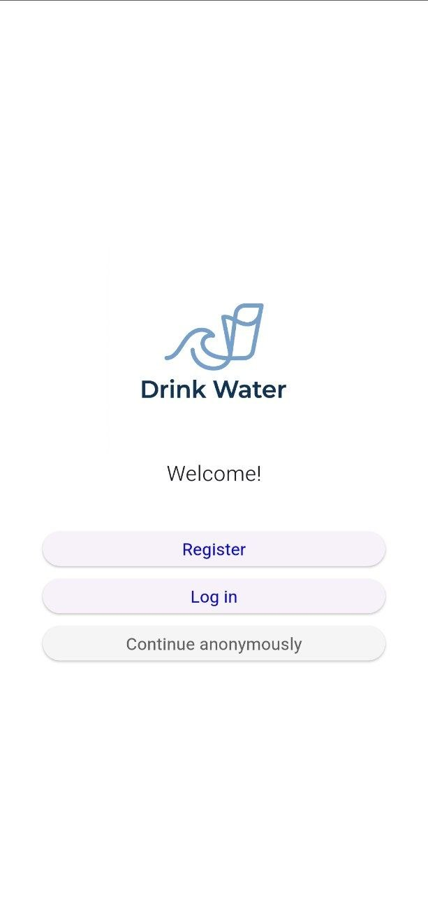
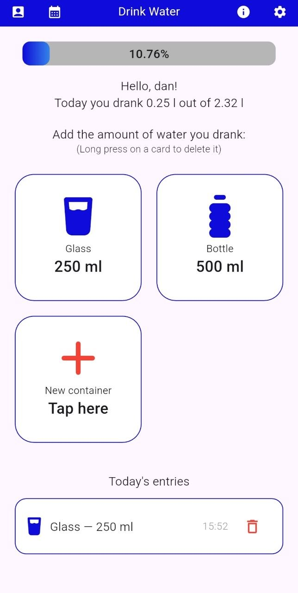
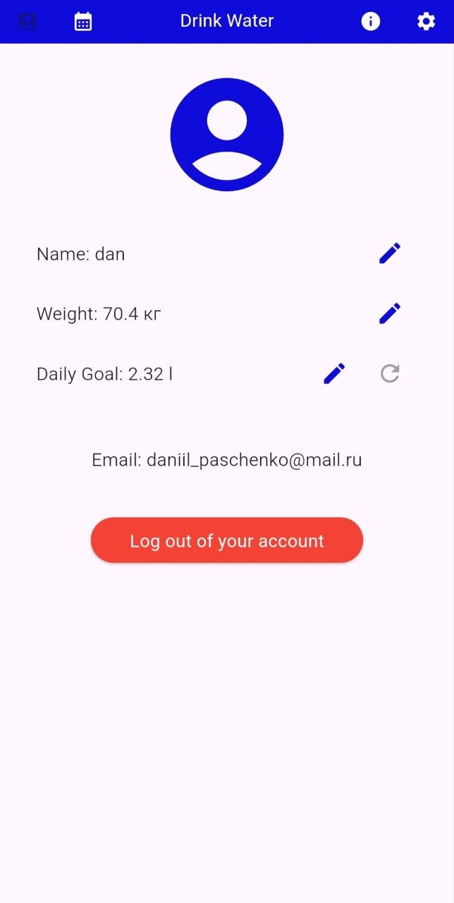
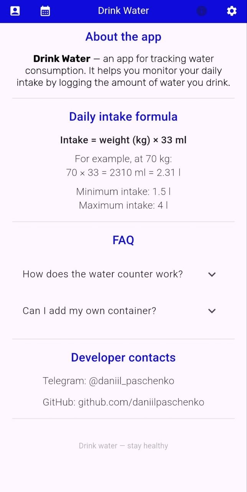

**[Read this in English](README.md)**

# Drink Water

Мобильное приложение для отслеживания потребления воды в течение дня. Разработано с использованием Flutter


## Скриншоты

<table align="center">
  <tr>
    <td align="center">
      <br>
    </td>
    <td align="center">
      <br>
    </td>
    <td align="center">
      <br>
    </td>
    <td align="center">
      <br>
    </td>
  </tr>
</table>


## Функционал

- Беспарольная аутентификация через ссылку, которая приходит на почту
- Регистрация пользователя с расчётом дневной нормы воды по формуле (вес × 33 мл)
- Отслеживание выпитой воды в реальном времени с индикатором прогресса
- История потребления воды по дням с календарём на неделю
- Пользовательские карточки ёмкостей с возможностью выбора иконки и объёма
- Активность за сегодня с возможностью удаления записи и просмотра времени добавления
- Редактирование профиля: имя, вес, дневная цель
- Автоматический сброс счётчика при наступлении нового дня
- Сохранение данных между сессиями
- Локализация: полная поддержка английского и русского языков с динамическим переключением внутри приложения


## Технологии

- **Flutter** — UI-фреймворк
- **Provider** — управление состоянием (state management)
- **Firebase Auth** — аутентификация
- **Cloud Firestore** — облачная база данных
- **SharedPreferences** — локальное хранилище
- **percent_indicator** — индикатор прогресса
- **font_awesome_flutter** — иконки
- **app_links** — обработка Deep Link для аутентификации через magic link


## Принципы разработки

- Чистая архитектура (Clean Architecture)
- Принципы SOLID
- Repository Pattern
- Внедрение зависимостей (Dependency Injection через Provider)
- Адаптивный интерфейс (Responsive UI) — все размеры рассчитываются относительно ширины экрана


## Запуск проекта

**Требования:**
- Flutter SDK 3.x+
- Dart 3.x+

**Установка:**

```
git clone https://github.com/daniilpaschenko/drink-water.git
cd drink-water
flutter pub get
flutter run
```